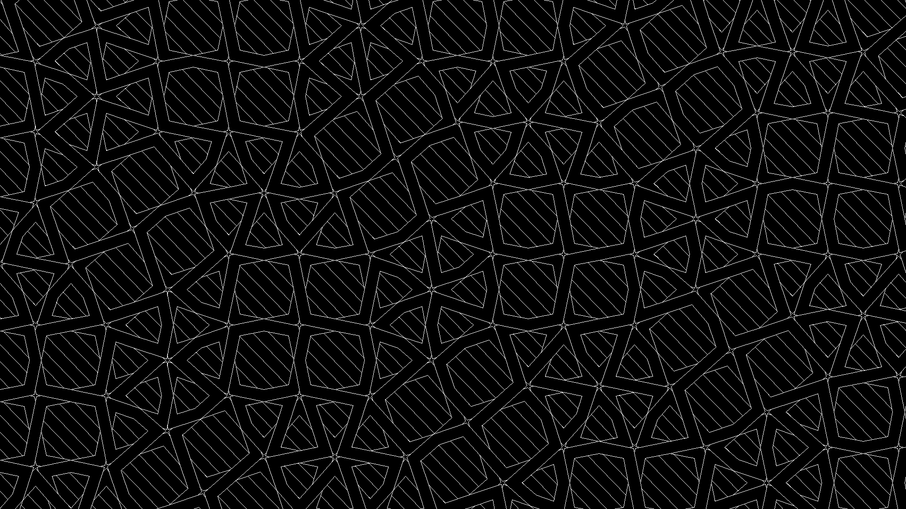

# Mortier 

## A Python-based tiling generator
Mortier is a powerful Python-based tiling generator. Mortier can generate regular, aperiodic and hyperbolic tilings. It is also able to generate an infnity of other tilings based on the ["Polygon in Contact"](https://dl.acm.org/doi/10.5555/1089508.1089538) technique. Mortier can output your tiling as a vector SVG, or a nice PNG. It even has support for Tikz figure generation.

The algorithm for constructing the regular polygon is described in Dr. Soto Sanchez's thesis [*On Periodic Tilings with Regular Polygons*](http://ieeexplore.ieee.org/stamp/stamp.jsp?tp=&arnumber=8614306&isnumber=8614297). Mortier uses [Hypertiling](https://gitpages.physik.uni-wuerzburg.de/hypertiling/hyperweb/) to generate the Hyperbolic tesselations. 

Mortier also implements hatch filling (lines or dots) for your tilings, and is able to create "laceworks", where the sides of the faces are shown as "laces" going under and over each other, creating a style similar to Celtic laceworks.

## Features

- Tessellation types:
    - RegularTesselation: Lattice-based tilings from a database of predefined seeds.
    - PenroseTesselation: P2 and P3 aperiodic tilings with configurable inflation depth.
    - HyperbolicTesselation: {p, q} hyperbolic tilings with multiple layers and refinement.

- "Polygon in Contact" implementation: 
    - Fast 
    - Parametrisation of the angles with sinus, Perlin, or Simplex noise
    - Asymmetrical rays and separated projection sites

- Rendering backends:
    - BitmapWriter: Export as raster images (PNG, JPEG, etc.).
    - SVGWriter: Export scalable vector graphics.
    - TikzWriter: Export LaTeX TikZ figures.

- Even more customizations:
    - Bands and lace modes with configurable width
    - Bézier curve sides for smooth rendering
    - Hatch fill patterns with angle, spacing, and cross-hatching options
    - Optional half-plane conversion for hyperbolic tilings
    - Flexible scaling and output size

## Installation
For ease of installation, Mortier uses `Poetry`, so you should probably install this first.

Once you have poetry install, run:
```
git clone git@github.com:epsln/mortier.git
cd mortier
poetry install
```

## Usage 
Running mortier without any argument will generate a random semi-regular tesselation:
```
poetry run python src/mortier/mortier.py
```

Now, to add some complexity (breathe in now):

Generate a random semi-regular paving, output on a file named foo.svg sized as 297x210mm, zoomed out slightly, with the Polygon in Contact method used with an angle equals 0.2, with sides represented as bands with a width of 1mm and hatch the faces with lines which are angled by 0.4 radians. 
```
python main.py --tesselation_type regular --tess_id "example_id" \
               --file_type svg --output foo \
               --output_size 1920 1080 --scale 50 \
               --angle 0.2 --bands --hatch_type line --hatch_angle 0.4 
```

### CLI Options
As seen just above, Mortier provides extensive control over the generated tilings

- `--tesselation_type` : regular, hyperbolic, penrose
- `--tess_id` : ID of the tessellation in the database (data/database.json)
- `--file_type` : bitmap, svg, tikz
- `--output` : Output filename
- `--output_size` : Width and height in pixels or in mm if using SVG output
- `--scale` : Tessellation scale factor
- `--angle` : Global ray angle (0–π/2)
- `--parametrised`: Parametric angle type (sin, perlin, simplex)
- `--bands` : Enable bands mode
- `--lace` : Enable lace mode
- `--bezier` : Draw sides as Bézier curves
- `--bands_width` : Width of bands
- `--hatch_type` : Type of hatch fill
- `--hatch_angle` : Hatch angle in degrees
- `--hatch_spacing` : Distance between hatch lines
- `--cross_hatch` : Enable cross-hatching
- `--pq` : Sides and neighbors for hyperbolic tiling (p, q)
- `--tile` : Tile type for Penrose (P2, P3)
- `--depth` : Inflation depth for Penrose/hyperbolic
- `--half_plane` : Convert hyperbolic tiling to half-plane model
- `--refine` : Refinement level for hyperbolic tiling
- `--assym_angle` : Asymmetrical ray angle
- `--separated_sites` : Separate the projection sites of the rays as a fraction of the side

## Testing

Run tests with:

```
poetry run pytest
``` 

## Acknowledgements
- The Dr. Sotò-Sanchez [thesis](https://doi.org/10.1007/s00371-019-01665-y), whose tiling generation algorithm is implemented here.
- The Polygon in Contact technique, nicely explained by Kaplan et al. in this [article](https://dl.acm.org/doi/10.5555/1089508.1089538).
- The great `Hypertiling` library, fast and easy to use. 
